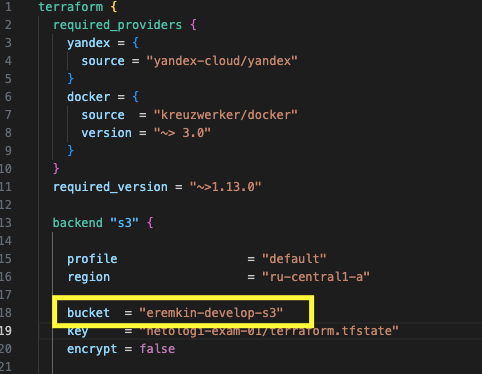
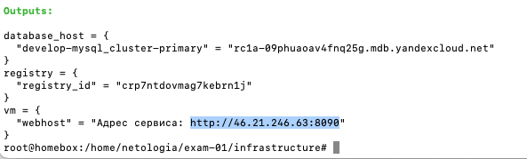
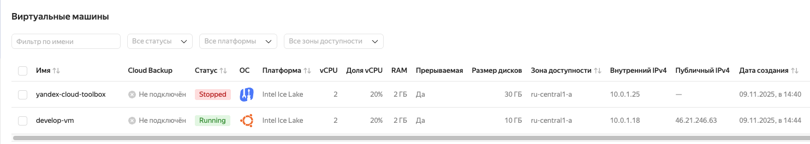
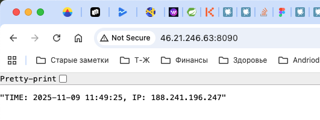

## Итоговая работа «Облачная инфраструктура. Terraform»

### Пред началом работу нужно:

1. Установить Yandex Cloud CLI (https://yandex.cloud/ru/docs/cli/quickstart)
   
2. В Yandex Cloud:
   - создать облако и дерикторию
   - создать бакет s3 для хранения стейта terraform
   - сгенеррировать токет OAuth

### Настройка и порядок запуска

1. Создать файл `personal.auto.tfvars` и указать token OAuth
```json   
yc_auth_token = "y0__..."
```   
2. В файле `terraform.tfvars` указать облако и папку
```json
cloud_id = "b1gihu82d9h8r313j7a5"
folder_id = "b1gj0sr3cl6nufnd1f07"
```
3. В файле providers.tf указать s3 бакет, созданный на предварительном этапе



4. Выполнить инициализацию `terraform init` развернуть инфраструктуру `terraform apply`

### Результат 

В результате работы должно получиться:
1. Сеть с политиками безопасности
2. Кластер mysql
3. Реестр для хранения docker образов
4. Витруальная машина с установленным docker и docker compose
5. Web-приложение, которое доступно по ip адресу ВМ на порту 8090








